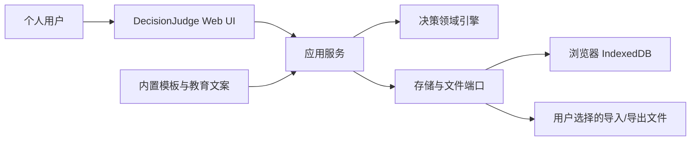
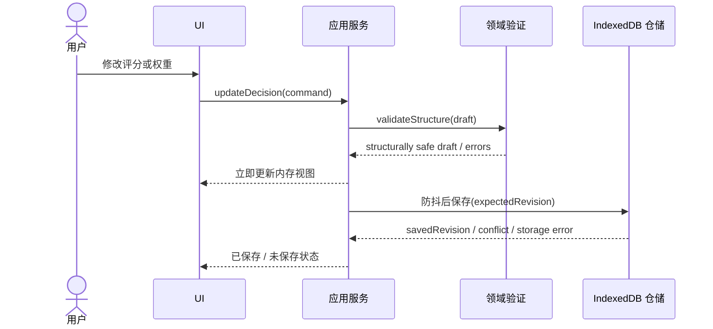

# DecisionJudge 软件架构文档

> 状态：待评审  
> 版本：0.1  
> 日期：2026-08-23  
> 需求基线：[`requirements.md`](./requirements.md) 1.0

## 1. 背景与目标

DecisionJudge MVP 是一款无账号、无云端依赖的本地单用户 Web 应用。它为低频、高重要性决策提供模板、加权评分、机会成本解释、沉没成本纠偏和敏感性分析。

架构目标：

- 离线可用，决策数据默认不离开用户设备。
- 计算确定、可测试、可解释，不由 UI 或存储层暗中改变。
- 基础模式保持简洁，高级模块可独立启用。
- 数据可导入导出，并为未来云端或微信小程序迁移保留稳定边界。
- 避免为尚未存在的云端业务引入后端、微服务、队列或运维负担。

## 2. 范围与非目标

### 2.1 MVP 范围

- 响应式单页 Web 应用。
- 四个内置决策模板。
- 决策编辑、自动保存、排名、解释和快照。
- 本地持久化、导入、导出和删除。
- 基础加权模型与按模块启用的高级计算。
- 简体中文 UI，文案集中管理。

### 2.2 非目标

- 账号、后端 API、云端同步、微信小程序。
- AI 模型调用或个人 API 密钥管理。
- 多人协作、公开分享、专业决策建议。
- 实际结果跟踪与系统化复盘。

## 3. 需求与验收追踪

| 需求能力 | 主要组件 | 数据 | 契约 | 测试 |
| --- | --- | --- | --- | --- |
| 模板创建决策 | Template Catalog, Decision Service | Decision | `createDecision` | 模板集成测试 |
| 硬约束排除 | Domain Engine | Constraint, Option | `evaluateDecision` | 领域单元测试 |
| 加权评分与排名 | Domain Engine | Criterion, Factor, Score | `evaluateDecision` | 精确结果单元测试 |
| 机会成本 | Explanation Engine | EvaluationResult | `evaluateDecision` | 排名与次优方案测试 |
| 沉没成本纠偏 | Domain Engine, Education Content | SunkCost | `evaluateDecision` | 不影响排名的回归测试 |
| 高级模块 | Domain Engine | AdvancedSettings | `updateDecision`, `evaluateDecision` | 模块启停测试 |
| 自动保存 | Autosave Coordinator, Repository | Decision document | `saveDecision` | IndexedDB 集成测试 |
| 不可变快照 | Snapshot Service | Snapshot | `createSnapshot` | 快照不受后续编辑影响 |
| 导入导出 | Portability Service | Export envelope | `exportData`, `importData` | 往返一致性测试 |

## 4. 系统上下文与边界

系统不与外部服务通信。导出只在用户明确操作时创建本地文件；导入文件在验证通过前不得修改现有数据。

## 5. 架构与组件职责

采用模块化前端单体和端口/适配器边界。依赖方向为 `UI -> Application -> Domain`；持久化依赖通过领域外的端口倒置。

### 5.1 UI 层

- **所有者**：前端界面模块。
- **输入**：用户操作、应用服务 DTO。
- **输出**：用例命令、可视化和场景化教育内容。
- **依赖**：应用服务和集中文案；不直接访问 IndexedDB。
- **失败行为**：保留未提交表单，显示可操作错误，不伪造成功状态。

### 5.2 应用服务层

- **所有者**：用例与工作流模块。
- **输入**：稳定命令 DTO。
- **输出**：决策视图、评估结果、导出包。
- **依赖**：领域引擎、仓储端口、时钟和 ID 生成端口。
- **失败行为**：返回类型化错误；不向 UI 泄漏 IndexedDB 异常对象。

### 5.3 领域引擎

- **所有者**：纯 TypeScript 领域模块。
- **输入**：经过结构验证的 Decision 聚合、计算版本。
- **输出**：EvaluationResult 及解释事实。
- **依赖**：无 UI、浏览器、时钟或存储依赖。
- **失败行为**：保存时只要求结构安全，允许未填完草稿；评估和快照时对违反完整业务不变量的输入返回验证错误，不产生部分结果。

### 5.4 持久化与迁移

- **所有者**：基础设施适配器。
- **输入**：可持久化聚合、快照和导入包。
- **输出**：已保存版本、列表和迁移后数据。
- **依赖**：IndexedDB；建议用 Dexie 封装版本和事务。
- **失败行为**：存储配额不足或迁移失败时停止写入，保留可读旧数据并提示导出备份。

### 5.5 模板与教育内容

- **所有者**：版本化静态内容模块。
- **输入**：模板 ID 和内容 key。
- **输出**：默认维度、权重、评分锚点和经济学解释。
- **依赖**：无运行时外部依赖。
- **失败行为**：未知模板不能创建决策；旧决策使用创建时已复制的模板数据，不被后续模板更新暗中改写。

## 6. 运行时、部署与数据流

### 6.1 技术基线

- React + TypeScript + Vite。
- IndexedDB，使用 Dexie 提供类型化仓储、事务和版本迁移。
- 形式验证使用 Zod，同时覆盖导入包和持久化边界。
- 可视化使用支持无障碍文本回退的轻量图表组件；具体库在 UI 实现前确定。
- Vitest 用于领域和应用测试，Testing Library 用于组件测试，Playwright 用于关键流程。

### 6.2 编辑与自动保存

同一决策使用递增 `revision` 防止多标签页静默覆盖。MVP 不合并并发编辑；检测冲突后必须让用户选择重载或导出当前草稿。

### 6.3 评估

UI 提交当前草稿，应用层先执行“可评估性”验证，检查权重、评分、情景概率和约束，再调用指定 `calculationVersion` 的纯函数引擎。结果默认不持久化，可从决策重算；创建快照时同时封存输入和结果。

### 6.4 导入

导入分为解析、schema 验证、版本迁移、预览和原子提交五步。默认采用“保留现有数据并为冲突 ID 生成新 ID”，不提供未预览的全量覆盖。

### 6.5 部署

MVP 构建为静态资源，可通过本地开发服务器或任意静态文件服务运行。不将 `file://` 直接打开作为支持方式，因为浏览器模块和本地存储行为不稳定。可在后续打包为 PWA 或桌面容器，但不影响领域和应用层。

## 7. 安全、可靠性、可观测性与扩展性

### 7.1 安全与隐私

- 无运行时第三方网络请求；字体、图标和静态资源随应用打包。
- 导入内容仅按 JSON 数据处理，不解析 HTML，所有用户文本在 UI 中作为纯文本渲染。
- 不在日志中记录决策正文。
- 导出文件明示包含私密决策数据；MVP 不声称提供端侧加密。
- 依赖版本锁定并进行基础漏洞扫描。

### 7.2 可靠性

- 自动保存状态在界面可见，离开未保存内容前警告。
- 导入、删除、快照创建使用原子事务。
- 导出包包含 `schemaVersion`、`calculationVersion` 和校验所需的元数据。
- 快照是不可变记录；修改需新建快照。

### 7.3 可观测性

MVP 不发送遥测数据。仅在本地记录不包含决策正文的诊断事件，如 schema 版本、迁移结果、错误代码和时间。用户可显式导出诊断信息。

### 7.4 扩展性

- 计算策略按版本注册，旧快照保持原计算结果。
- Repository 和 Portability 为端口，未来可增加云端适配器，但不在 MVP 同时实现。
- 领域包不依赖 DOM，可供小程序或服务端复用。

## 8. 关键决策与备选方案

### ADR-001：本地优先静态 Web

- **决策**：MVP 无后端，使用 IndexedDB。
- **理由**：满足无账号、无云依赖和隐私默认。
- **放弃**：SQLite + 本地服务端增加安装成本；`localStorage` 缺少事务、容量和查询能力。

### ADR-002：决策聚合文档持久化

- **决策**：每个可编辑决策作为一个聚合文档原子保存，快照另存。
- **理由**：选项、维度、因素和评分始终一起编辑，文档可降低自动保存和迁移复杂度。
- **放弃**：完全关系式拆分会增加多表事务，MVP 不需要跨决策聚合查询评分明细。

### ADR-003：评估结果可重算，快照例外

- **决策**：草稿不持久化派生结果；快照同时保存决策输入、结果和计算版本。
- **理由**：避免草稿数据与结果失配，同时保持历史可解释性。

### ADR-004：不设单一“高级计算开关”

- **决策**：总开关只控制 UI 展开，每个高级模块独立启停。
- **理由**：防止折叠 UI 意外改变结果，并使结果能指出具体生效模块。

## 9. 风险、假设与开放项

| 项目 | 影响 | 缓解 |
| --- | --- | --- |
| 用户清理浏览器数据 | 决策丢失 | 明确本地存储边界，提供导出备份提醒 |
| 加权和制造虚假精度 | 误导用户 | 显示假设、净优势和敏感性，避免“正确答案”文案 |
| 维度或因素重复 | 重复计分 | 模板审查、重叠提示、结果贡献度透明 |
| 旧数据与新计算版本 | 结果漂移 | 快照封存版本和结果；草稿升级时提示 |
| IndexedDB 隐私模式/配额限制 | 无法持久化 | 启动时能力检查，保存状态明示，支持立即导出 |
| 小程序存储能力不同 | 未来迁移成本 | 领域与存储端口分离，使用稳定导出 schema |

开放项：图表组件库和是否在 MVP 安装 PWA service worker，两者不影响公开数据或领域契约。

## 10. 增量交付计划

1. **基础工程**：搭建 React/TypeScript，建立领域、应用、基础设施和 UI 边界。
2. **基础决策纵向切片**：“升学还是就业”模板、方案、维度、权重、评分和排名。
3. **经济学解释**：硬约束、机会成本、沉没成本和敏感性。
4. **本地可靠性**：IndexedDB 自动保存、冲突检测、删除、导入和导出。
5. **快照**：确认选择并封存决策和结果。
6. **高级微调**：维度内因素、客观值换算、情景、风险、折现和稳定区间，按模块逐个交付。
7. **回归与发布**：响应式和无障碍检查、导入迁移测试、全流程 E2E 和 MPL-2.0 发布文件。
