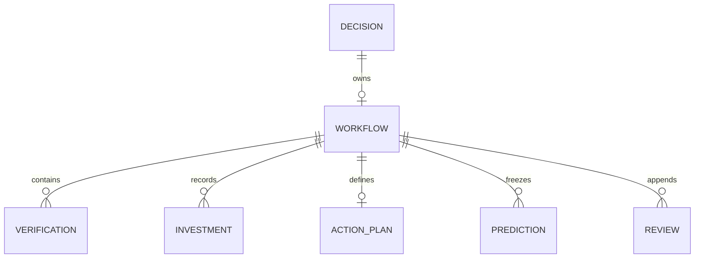
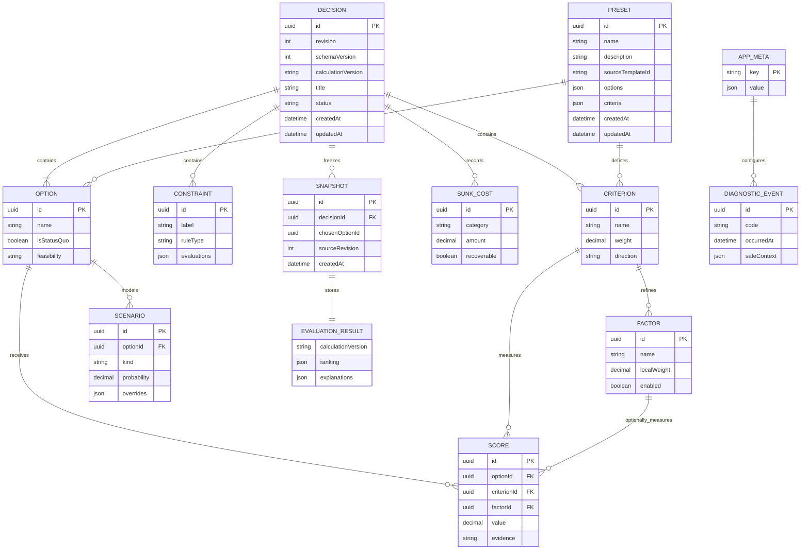

# DecisionJudge 本地数据模型

## 0.3 配置与内存边界

无 IndexedDB 迁移：`Decision.advancedUiExpanded` 保存普通/专业模式；权重备注复用 `Criterion.description`，评分备注复用 `Score.evidence`，专业信息隐藏时保留。

独立 localStorage 键 `decisionjudge-assistant-settings-v1` 保存 `{baseUrl,model,presetId,systemPrompt}`，通过 schema 丢弃其它字段。API 密钥只存在内存，刷新清除；聊天与待应用草稿属于当前编辑器会话，不进入 Decision、快照或备份。三组提示词为静态预设，可编辑所选提示词并保存其当前版本。

助手应用仅更新当前 Decision 的问题与比较结构，选项/维度重新分配 UUID；旧评分清空，约束需重新核实。既有验证记录保留、清理失效外键，快照/复盘/预测仍保持原有生命周期与保护规则。

> 2026-09-24 实现状态：`Decision.workflow` 聚合已拥有验证任务、投入边界与记录、行动计划、预测、`reviewDraft` 和追加式复盘。保存按 revision 在事务内校验，导入使用批量新增避免覆盖；下文中的 Factor、Scenario 等仍为后续目标模型。

> 2026-09-21 增量：Decision 新增可选 `workflow` 聚合，拥有验证任务、投入边界与记录、行动计划、预测和复盘。Score 新增可选来源、日期、依据类型与信心。缺失字段按空值展示，IndexedDB store 不变；旧快照原样保留。具体规则见 [实施计划](./implementation-plan.md)。下文中的 Factor、Scenario 等仍为后续目标模型。

> 状态：已实现基线，持续演进
> 版本：0.2
> 日期：2026-08-23

## 1. 存储策略

MVP 使用 IndexedDB。可编辑决策作为一个聚合文档原子保存，内含选项、约束、维度、因素、评分、沉没成本和高级设置。不可变快照使用独立 object store。

本文的 ER 图同时表达持久化 object store 和 Decision 文档内部的概念实体。文档内实体不是独立 IndexedDB store，其生命周期由 Decision 聚合管理。

## 2. ER 图

## 3. Object Store 目录

### 3.1 `decisions`

| 字段 | 类型 | 可空 | 说明 |
| --- | --- | --- | --- |
| `id` | UUID string | 否 | 主键，导入冲突时可重新生成 |
| `revision` | positive integer | 否 | 每次成功保存加 1，用于乐观并发控制 |
| `schemaVersion` | positive integer | 否 | 持久化 schema 版本 |
| `calculationVersion` | string | 否 | 草稿当前使用的计算规则版本 |
| `template` | object | 否 | 模板 ID、版本和创建时快照 |
| `title` | string | 否 | 1–120 字符 |
| `objective` | string | 是 | 决策目标 |
| `decisionDate` | ISO date | 是 | 计划决策日期 |
| `status` | enum | 否 | `draft` / `decided` |
| `advancedUiExpanded` | boolean | 否 | 只控制 UI，不控制计算 |
| `options` | Option[] | 否 | 草稿可为空；评估时至少 2 个 |
| `constraints` | Constraint[] | 否 | 可为空数组 |
| `criteria` | Criterion[] | 否 | 草稿可未配置完；评估时至少 1 个且启用权重和为 1 |
| `scores` | Score[] | 否 | 按选项和维度/因素唯一 |
| `sunkCosts` | SunkCost[] | 否 | 可为空数组，不进入净未来效用 |
| `advancedSettings` | object | 否 | 每个高级模块有独立 `enabled` |
| `chosenOptionId` | UUID string | 是 | 必须引用聚合内选项 |
| `createdAt` | ISO datetime | 否 | 创建时间 |
| `updatedAt` | ISO datetime | 否 | 最后成功保存时间 |

- **主键**：`id`。
- **索引**：`updatedAt`、`status`、`template.id`。
- **唯一约束**：文档内所有实体 ID 在聚合内唯一；Score 的 `(optionId, criterionId, factorId|null, scenarioId|null)` 唯一。
- **保留/删除**：用户显式删除。删除决策时不默认删除快照，UI 需明示询问是否一并删除。

### 3.2 `snapshots`

| 字段 | 类型 | 可空 | 说明 |
| --- | --- | --- | --- |
| `id` | UUID string | 否 | 主键 |
| `decisionId` | UUID string | 否 | 来源决策 ID，逻辑外键 |
| `sourceRevision` | integer | 否 | 封存时的草稿版本 |
| `chosenOptionId` | UUID string | 否 | 封存时选择的可行方案 |
| `decision` | DecisionSnapshot DTO | 否 | 深拷贝后的输入，不包含 UI 暂态 |
| `result` | EvaluationResult DTO | 否 | 封存的排名与解释 |
| `schemaVersion` | integer | 否 | 快照 schema 版本 |
| `calculationVersion` | string | 否 | 结果的计算规则版本 |
| `createdAt` | ISO datetime | 否 | 创建时间 |

- **主键**：`id`。
- **索引**：`decisionId`、`createdAt`。
- **不变性**：创建后禁止 update；更改选择需创建新快照。
- **删除**：用户可显式删除快照。来源决策删除后快照可独立存在。

### 3.3 `appMeta`

| 字段 | 类型 | 可空 | 说明 |
| --- | --- | --- | --- |
| `key` | string | 否 | 主键，如 `installationId`, `schemaVersion`, `lastBackupReminderAt` |
| `value` | JSON value | 否 | 按 key 受 schema 验证 |

- **保留**：随本地应用数据保留。
- **导出**：只导出与数据解析有关的版本元数据，不导出设备标识。

### 3.4 `diagnosticEvents`

| 字段 | 类型 | 可空 | 说明 |
| --- | --- | --- | --- |
| `id` | UUID string | 否 | 主键 |
| `code` | string enum | 否 | 稳定诊断代码 |
| `occurredAt` | ISO datetime | 否 | 发生时间 |
| `safeContext` | object | 否 | 仅版本、操作和错误类别，不包含用户文本 |

- **索引**：`occurredAt`、`code`。
- **保留**：最多 200 条或 30 天，先到者清理。
- **导出**：仅在用户显式导出诊断信息时包含。

## 4. 聚合内实体约束

### Option

- `id` 在 Decision 中唯一，`name` 在去除首尾空格后不得为空。
- 未完成草稿可少于两个 Option；评估时至少存在两个。任何时候最多一个 `isStatusQuo=true`。
- 约束评估将 Option 标记为 `feasible` / `infeasible` / `unknown`；`infeasible` 不进入排名。

### Criterion 与 Factor

- 为了自动保存，草稿可处于“权重尚未分配完”状态。评估时至少一个启用 Criterion，启用 Criterion 的权重和必须等于 1。权重存储为十进制数而不是百分比文本。
- 如 Criterion 启用因素计算，评估时至少一个 Factor 启用，其 `localWeight` 之和等于 1。
- 直接维度分和因素分不得同时参与该维度计算。

### Score

- 手动评分范围为 1–10，最多保留 2 位小数。
- 评分可携带原始客观值、单位、理由和资料来源；基础模式不根据原始值自动改分。
- 自动换算评分必须保存换算规则参数和原始值，使结果可追溯。

### SunkCost

- `incurredAt` 不得晚于当前时间。
- `recoverable=false` 的已发生成本永不进入未来效用得分。
- 可收回部分应转换为方案的未来增量成本，而不是作为沉没成本计分。

### Scenario

- 情景模块启用时，每个参与方案都必须有乐观、基准、悲观三个情景。
- 每个方案的情景概率之和等于 1。
- 情景只覆盖明确列出的评分或现金流，其余继承基准值。

## 5. 事务、并发与删除

- 验证分为两级：持久化时执行结构安全验证，允许未完成草稿；评估和快照时执行完整业务不变量验证。
- 保存决策：单 `decisions` store 读写事务，仅当存储 `revision` 等于 `expectedRevision` 时更新。
- 创建快照：在 `decisions` + `snapshots` 读写事务中重新验证来源版本，生成结果，将 Decision 设为 `decided` 并记录 `chosenOptionId`，递增 revision，然后写入对应新 revision 的快照。
- 删除决策：用户选择保留快照时仅删除 Decision；选择全部删除时在跨 store 事务中删除 Decision 和相关 Snapshot。
- 导入：完整包在内存中验证和迁移后，在一个跨 store 事务中写入。
- 多标签并发：MVP 只检测冲突，不自动合并聚合。

## 6. 版本、迁移与备份

- IndexedDB 结构版本和文档 `schemaVersion` 分开管理。
- 迁移是按版本串行执行的纯函数，必须幂等并有固定样例测试。
- 未知的更高 schema 版本拒绝导入，不尝试降级。
- 导出包使用 UTF-8 JSON，包含包版本、创建时间、应用版本、schema 版本、计算版本、Decision 和 Snapshot。
- 恢复不覆盖现有数据；冲突记录默认生成新 ID，并重写包内引用。
- 本地数据没有服务端保留保证；UI 应定期提醒用户导出备份。

## 7. 种子数据

五个内置模板作为版本化应用资源发布，不存入 IndexedDB。从模板创建决策时，将模板 ID、版本和必要内容复制到 Decision，以保证模板升级不修改历史决策。用户预设存储在独立的 `presets` object store，仅保留方案、评价维度和权重等结构数据；使用预设创建决策时重新生成选项、维度和评分单元的 ID。
